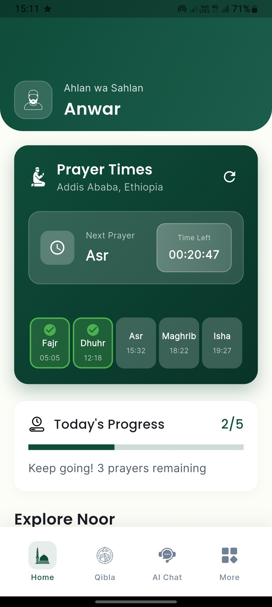
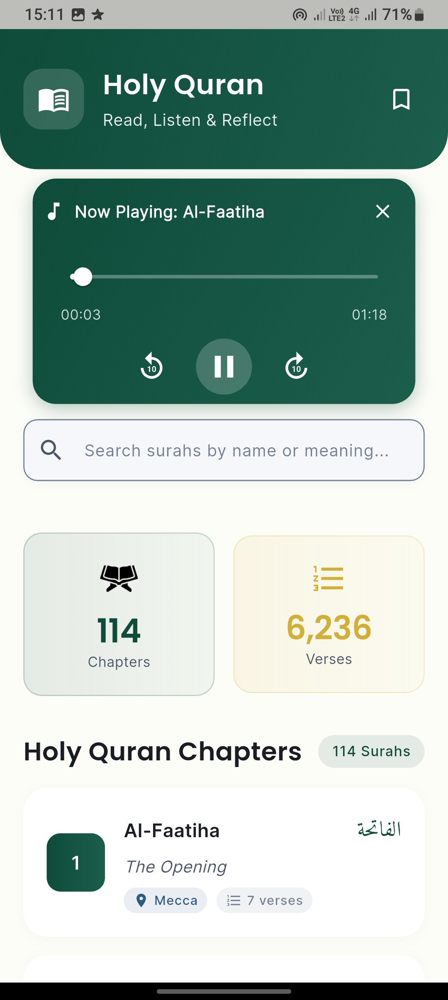
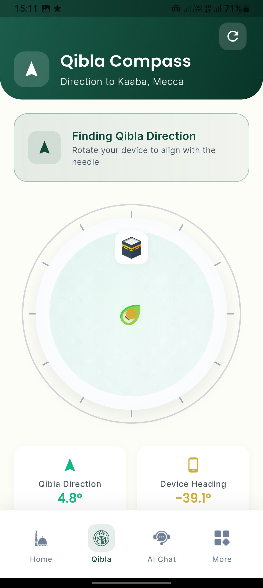
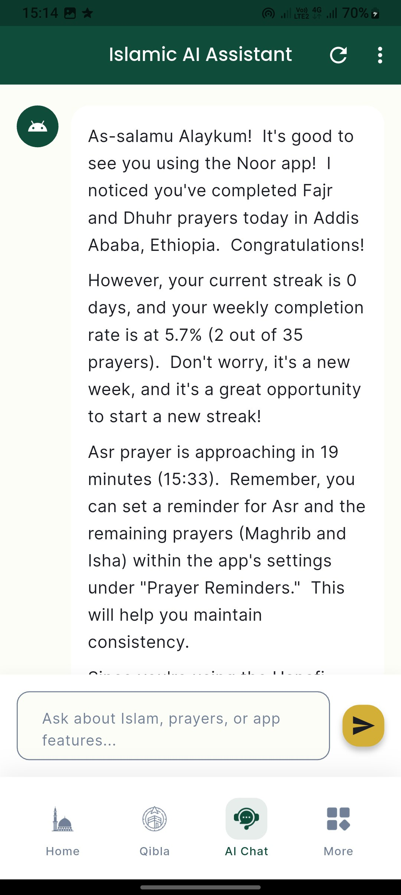
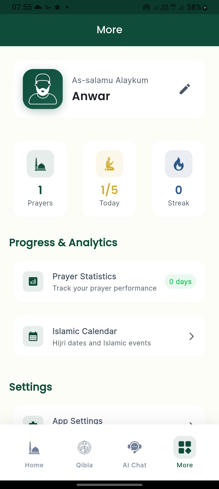

# Noor - Your Companion for a Mindful Muslim Life

<p align="center">
  
</p>

<p align="center">
  <strong>Noor</strong> is a beautifully designed Islamic mobile application built with Flutter. It's your all-in-one tool to help you stay on top of your daily prayers, read the Quran, track your progress, and much more. This project is open-source and we welcome contributions from the community.
</p>

<p align="center">
  
  
</p>

## ✨ Features

*   **Prayer Times:** Get accurate prayer times based on your location.
*   **Qibla Direction:** An easy-to-use compass to find the direction of the Kaaba.
*   **Quran:** Read the Holy Quran with a clean and simple interface.
*   **Prayer Tracker:** Track your daily prayers and monitor your progress with insightful statistics.
*   **Dhikr & Tasbih:** A digital tasbih to help you with your daily dhikr.
*   **AI Assistant:** An integrated AI chatbot to answer your Islamic queries.
*   **Clean & Minimalist UI:** A beautiful and intuitive user interface.

## 📸 Screenshots

|                                Home Screen                                 | Quran | Qibla |
|:--------------------------------------------------------------------------:| :---: | :---: |
|                  |  |  |
|                                Prayer Stats                                | AI Chat | More |
|  |  |  |

## 🚀 Getting Started

To get a local copy up and running, follow these simple steps.

### Prerequisites

*   Flutter SDK: [Installation Guide](https://flutter.dev/docs/get-started/install)
*   An editor like VS Code or Android Studio.

### Installation

1.  **Fork the repository**
2.  Clone the repo
    ```sh
    git clone https://github.com/your-github-username/noor.git
    ```
3.  Install packages
    ```sh
    flutter pub get
    ```
4.  Run the app
    ```sh
    flutter run
    ```

## 🛠 Tech Stack & Packages

*   **Framework:** [Flutter](https://flutter.dev/)
*   **State Management:** [Riverpod](https://riverpod.dev/)
*   **HTTP Requests:** [http](https://pub.dev/packages/http)
*   **Audio:** [just_audio](https://pub.dev/packages/just_audio) & [audioplayers](https://pub.dev/packages/audioplayers)
*   **Location & Compass:** [geolocator](https://pub.dev/packages/geolocator), [geocoding](https://pub.dev/packages/geocoding), [flutter_compass](https://pub.dev/packages/flutter_compass)
*   **Local Storage:** [shared_preferences](https://pub.dev/packages/shared_preferences)
*   **UI:** [google_fonts](https://pub.dev/packages/google_fonts), [flutter_svg](https://pub.dev/packages/flutter_svg), [lottie](https://pub.dev/packages/lottie), [shimmer](https://pub.dev/packages/shimmer)
*   **AI:** [flutter_gemini](https://pub.dev/packages/flutter_gemini)
*   **And many more...**

## 🤝 Contributing

Contributions are what make the open-source community such an amazing place to learn, inspire, and create. Any contributions you make are **greatly appreciated**.

If you have a suggestion that would make this better, please fork the repo and create a pull request. You can also simply open an issue with the tag "enhancement".
Don't forget to give the project a star! Thanks again!

1.  Fork the Project
2.  Create your Feature Branch (`git checkout -b feature/AmazingFeature`)
3.  Commit your Changes (`git commit -m 'Add some AmazingFeature'`)
4.  Push to the Branch (`git push origin feature/AmazingFeature`)
5.  Open a Pull Request

## 📜 License

Distributed under the MIT License. See `LICENSE` for more information.

## 📧 Contact

Anexon - [@n3x0dev](https://twitter.com/n3x0dev) - anwarnasir0970@gmail.com

Project Link: [https://github.com/anexdev1/noor](https://github.com/anexdev1/noor)
